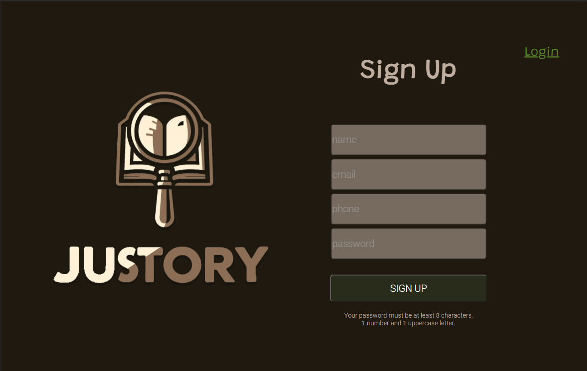
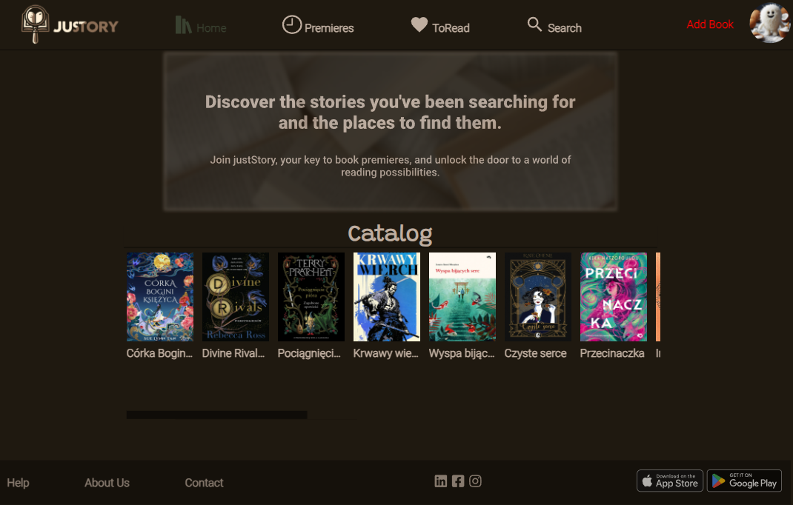
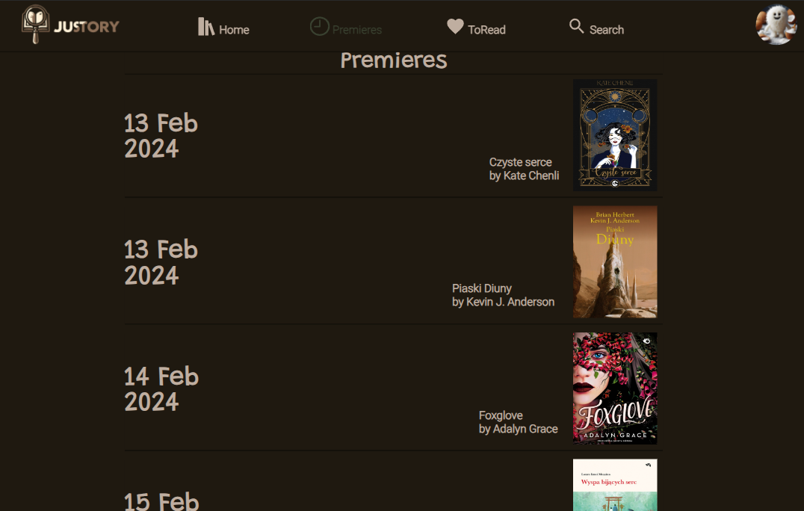
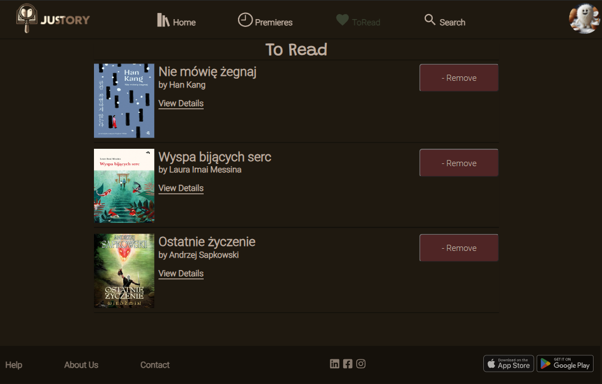
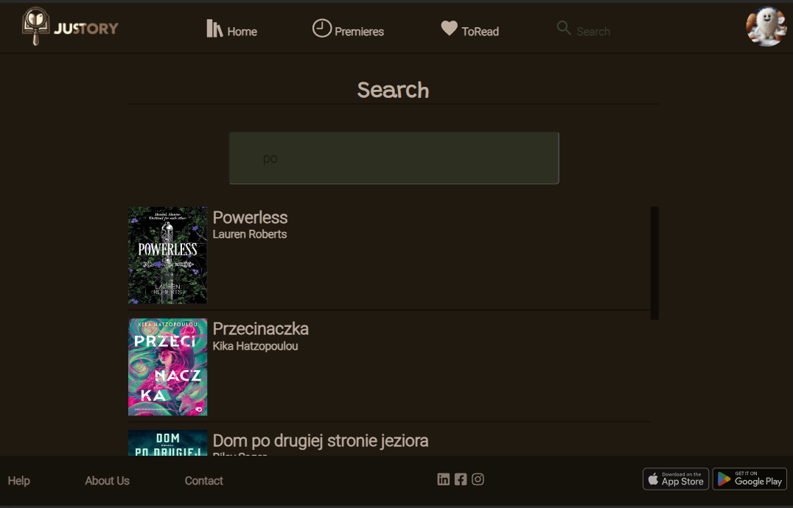
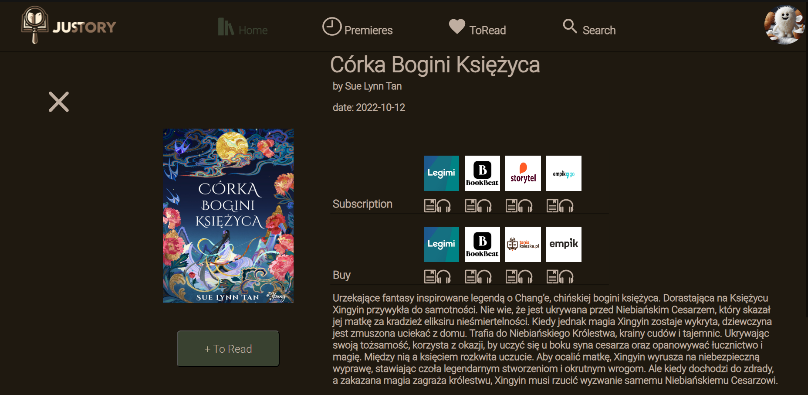

# WDPAI
# justStory 📖

## Description

The justStory book list application is a convenient tool for literature lovers.
It allows users to track upcoming book releases and find places where they can purchase or read e-books via subscription. Users can create accounts, log in and add titles of interest to their "To read" list.
​

## Table of Contents

- [Project Name](#justStory)
  - [Description](#description)
  - [Table of Contents](#table-of-contents)
  - [Installation](#installation)
  - [Usage](#usage)
  - [Diagram ERD](#DiagramERD)
  - [Acknowledgments](#acknowledgments)
  - [Creators](#creators)

## Installation

1. Clone this repository to your local machine using `git clone https://github.com/your-username/project-name.git`.
2. Navigate to the project directory using `cd project-name`.
3. Install the necessary dependencies using `npm install` or `pip install -r requirements.txt`.

## Usage
- **Registration and Login:**
  - Allows the user to create an account or log in, providing access to personalized application features.

- **Home Page:**
  - What You'll Find on the Home Page...
    
- **Viewing the Premier List:**
  - Provides the user with access to a list of the latest releases, allowing you to quickly become aware of the latest releases.
    
- **Adding and Removing to Your To-Read List:**
  - It allows the user to add and remove items of interest from the "To Read" list.
    
- **Resource Search:**
  - The user enters a query in the search box and the system presents results that match the query. Search is possible by title and author.
    
- **Exploring Books:**
  - After finding an interesting book, the user can check details about its availability. The application provides information about places where you can purchase or read an e-book. The user receives not only availability data, but also information about the formats available for purchase or reading, allowing the user to adjust the selection to their own preferences or preferred reading equipment.
    

## DiagramERD

## Acknowledgments

Special thanks to all the contributors and open-source projects that inspired and supported the development of this justStory application. Your passion for literature fuels our commitment to delivering a remarkable book-list experience.

## Creators
The project is developed by Dominika Hojniak. Contact: dominikahojniak@gmail.com